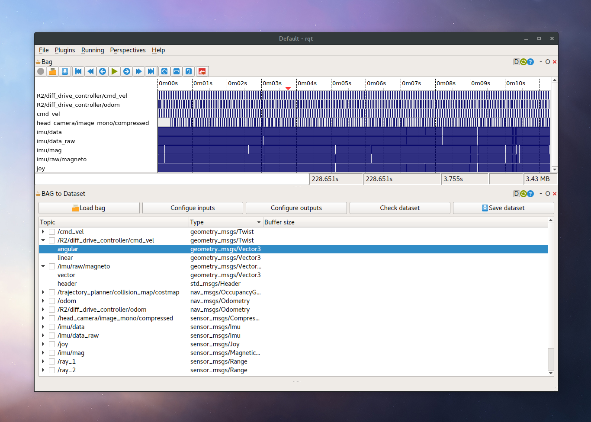
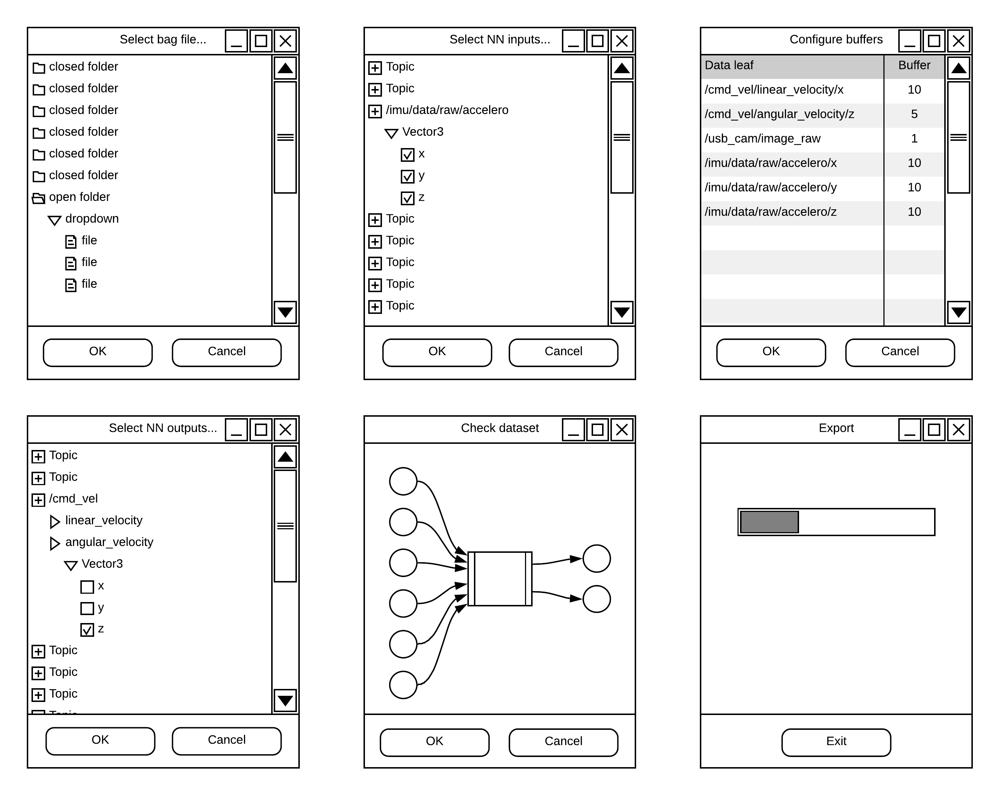

# rqt_bag_to_dataset
**rqt plugin to selectively convert data from rosbag to neural training dataset** 

:construction: work in progress :construction:

## Objectives ##

* select individual data leafs from topics stored in bags _( e.g. `twist.linear.x` )_
* optionally create flat temporal buffers for each leafs with given size
* export data with or without timestamps into a `CSV` file
* optionally map the data to input and output layers and _[export to data shape format](doc/datashape.md)_

### Proposed UX flow ###

